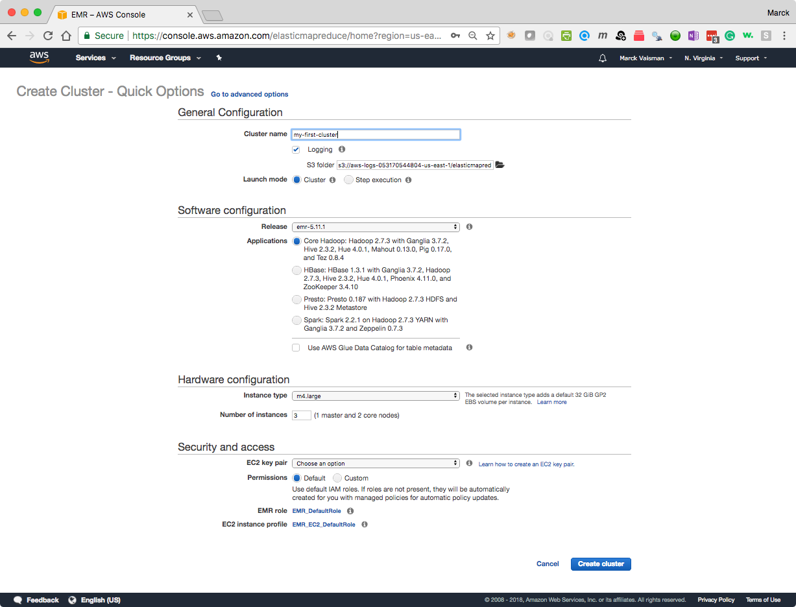
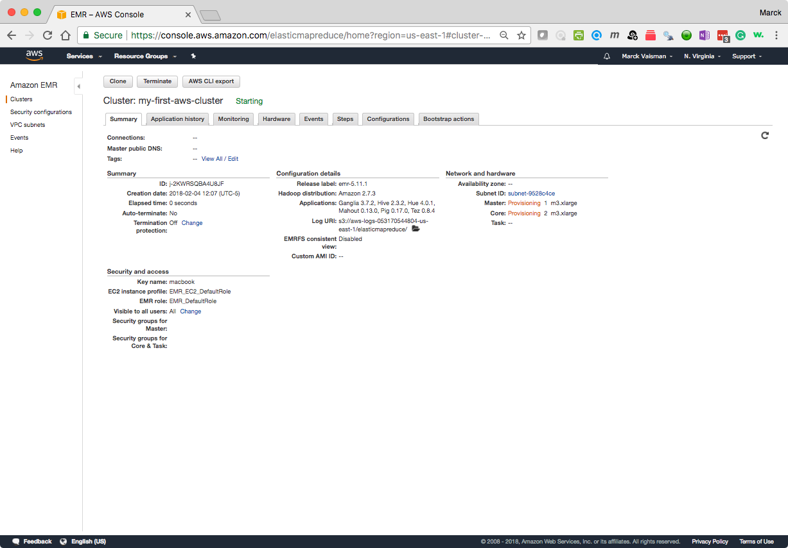
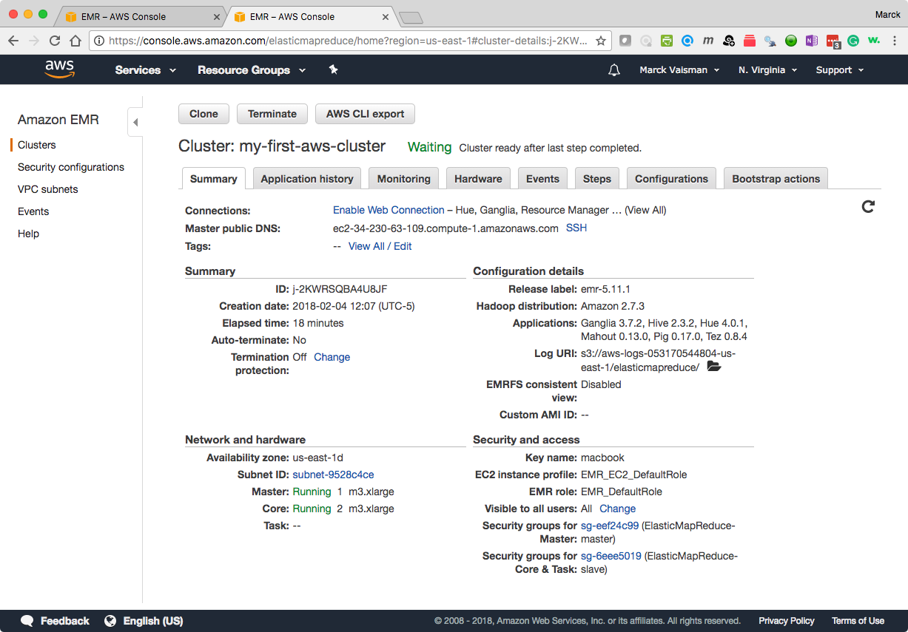
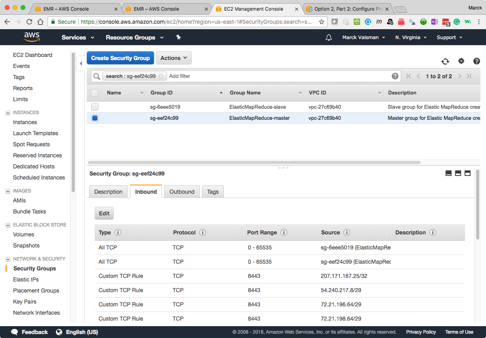
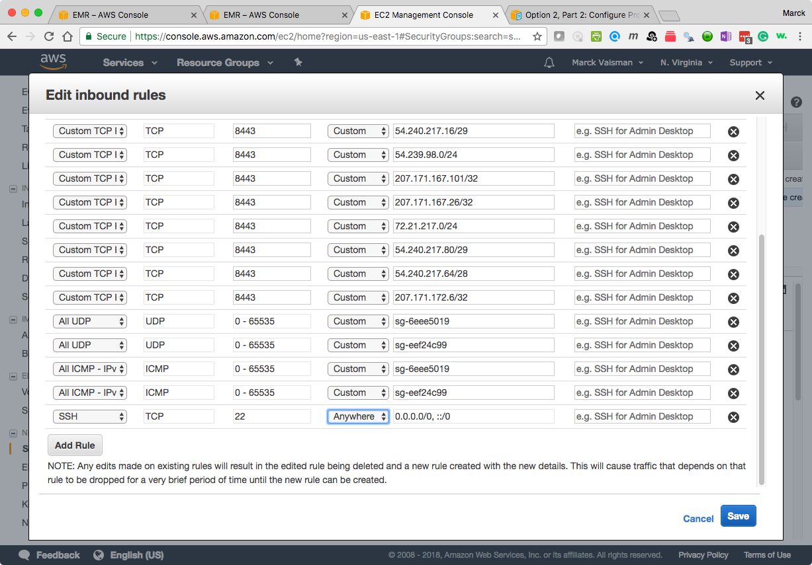
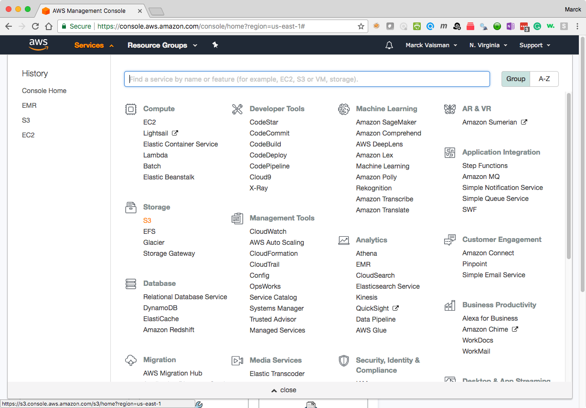
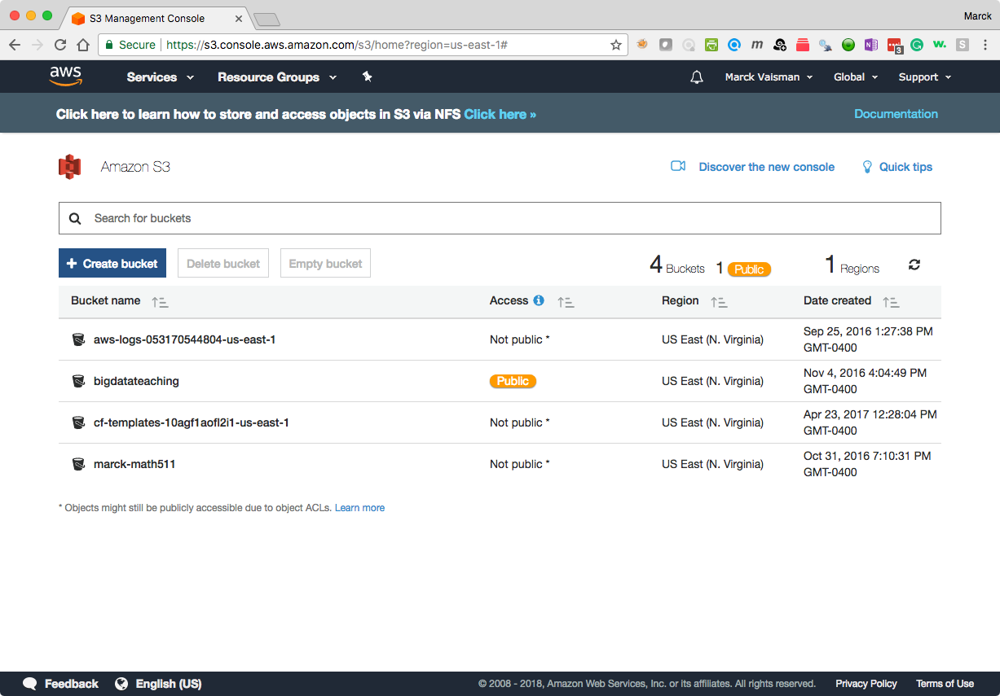
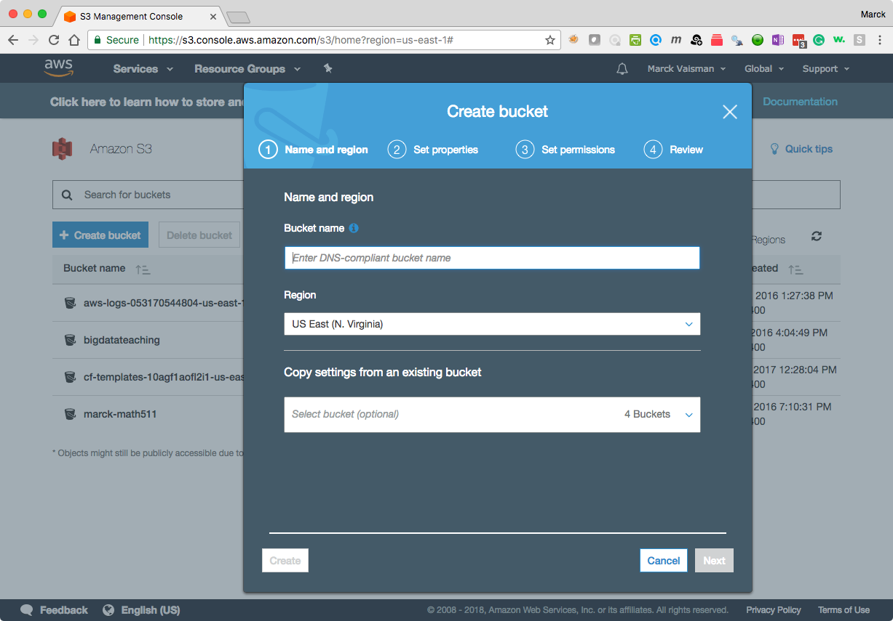

# Lab: Amazon EMR, Hadoop and Hadoop Streaming

## Cluster setup

### Start an Amazon Elastic MapReduce (EMR) Cluster using Quickstart with the following setup:

* In *General Configuration*
	*  Give the cluster a name that is meaningful to you
	*  Un-check *Logging*
	*  Make sure that *Cluster* is selected, NOT *Step execution*
*  In *Software configuration*
	*  Select `emr-5.20.0` Release from the drop-down
	*  Select the first option under Applications
*  In *Hardware configuration*
	*  Select `m4.large` as instance types 
	*  Enter `3` for number of instances (1 master and 2 core nodes)
* In *Security and access*
	* 	Select your correct EC2 keypair or you will not be able to connect to the cluster
*  Leave everything else the same
*  Click **Create Cluster**, and wait...

<br>
	As soon as you create the cluster, you will see the cluster in "Starting" mode:
	


### Setup the cluster security group
	
**You only need to do this one time, the first time you create a cluster:** 

Once the cluster is in "Waiting" mode, click on the **Security Groups for Master** which will take you to the Security Group configuration page, and add port 22 like you did in the _setting up_ Tutorial (Follow next three screenshots)

<br>
<br>
<br>

### SSH Into the Cluster

```
ssh hadoop@[[master-node-dns-name]]
```
Note the usernanme is **`hadoop`**. Get your cluster's master node IP address from the Cluster console.

You will see something like this:

```
morocoto ➜  ~  ssh hadoop@ec2-34-230-63-109.compute-1.amazonaws.com
Last login: Mon Feb  5 22:35:02 2018

       __|  __|_  )
       _|  (     /   Amazon Linux AMI
      ___|\___|___|

https://aws.amazon.com/amazon-linux-ami/2017.09-release-notes/
8 package(s) needed for security, out of 9 available
Run "sudo yum update" to apply all updates.

EEEEEEEEEEEEEEEEEEEE MMMMMMMM           MMMMMMMM RRRRRRRRRRRRRRR
E::::::::::::::::::E M:::::::M         M:::::::M R::::::::::::::R
EE:::::EEEEEEEEE:::E M::::::::M       M::::::::M R:::::RRRRRR:::::R
  E::::E       EEEEE M:::::::::M     M:::::::::M RR::::R      R::::R
  E::::E             M::::::M:::M   M:::M::::::M   R:::R      R::::R
  E:::::EEEEEEEEEE   M:::::M M:::M M:::M M:::::M   R:::RRRRRR:::::R
  E::::::::::::::E   M:::::M  M:::M:::M  M:::::M   R:::::::::::RR
  E:::::EEEEEEEEEE   M:::::M   M:::::M   M:::::M   R:::RRRRRR::::R
  E::::E             M:::::M    M:::M    M:::::M   R:::R      R::::R
  E::::E       EEEEE M:::::M     MMM     M:::::M   R:::R      R::::R
EE:::::EEEEEEEE::::E M:::::M             M:::::M   R:::R      R::::R
E::::::::::::::::::E M:::::M             M:::::M RR::::R      R::::R
EEEEEEEEEEEEEEEEEEEE MMMMMMM             MMMMMMM RRRRRRR      RRRRRR

[hadoop@ip-172-31-25-210 ~]$
```

### Install git and clone repository

3. Install git on the master node: `sudo yum install -y git`

3. Clone this repository to the master node

`git clone https://github.com/bigdatateaching/lab-mapreduce-hadoop-hdfs-hadoopstreaming.git`

4. Change directory into the lab: `cd bigdatateaching/lab-mapreduce-hadoop-hdfs-hadoopstreaming` 


## Lab Exercises

### Create your own S3 Bucket

You will create an S3 bucket of your own. EMR clusters can read/write data from the cluster's HDFS as well as S3 buckets. Remember, your HDFS storage gets deleted when you shut down a cluster. If you want to keep data files, you can save them to S3.

**Make sure your region is N. Virgina**

1. Go to the S3 Console
	<br>
	
2. Click "Create Bucket"	
	<br>

3. Enter a **globally unique bucket name.** Use a combination of letters, dashes and numbers. This name must me unique across all S3 buckets on Amazon. After the first screen, you can keep the defaults. Click Next 3 times and then "Create Bucket".
	<br>


### Run some HDFS commands

The reference guide for all the HDFS Shell commands is here: [https://hadoop.apache.org/docs/r2.7.3/hadoop-project-dist/hadoop-common/FileSystemShell.html](https://hadoop.apache.org/docs/r2.7.3/hadoop-project-dist/hadoop-common/FileSystemShell.html)

1. List files in your newly created cluster's HDFS (will be empty):
	`hdfs dfs -ls` or `hadoop fs -ls`
	
2. 	List files in a public S3 bucket owned by Prof. Vaisman, created for this course: 	`hdfs dfs -ls s3://bigdatateaching/`

	```
	[hadoop@ip-172-31-25-210 ~]$ hadoop fs -ls s3://bigdatateaching/
	Found 11 items
	drwxrwxrwx   - hadoop hadoop          0 1970-01-01 00:00 s3://bigdatateaching/criteo
	drwxrwxrwx   - hadoop hadoop          0 1970-01-01 00:00 s3://bigdatateaching/forensicswiki
	drwxrwxrwx   - hadoop hadoop          0 1970-01-01 00:00 s3://bigdatateaching/graphx
	drwxrwxrwx   - hadoop hadoop          0 1970-01-01 00:00 s3://bigdatateaching/ham
	drwxrwxrwx   - hadoop hadoop          0 1970-01-01 00:00 s3://bigdatateaching/internet-census-2012
	drwxrwxrwx   - hadoop hadoop          0 1970-01-01 00:00 s3://bigdatateaching/meta
	drwxrwxrwx   - hadoop hadoop          0 1970-01-01 00:00 s3://bigdatateaching/ncdc
	drwxrwxrwx   - hadoop hadoop          0 1970-01-01 00:00 s3://bigdatateaching/nyctaxi
	drwxrwxrwx   - hadoop hadoop          0 1970-01-01 00:00 s3://bigdatateaching/quazyilx
	drwxrwxrwx   - hadoop hadoop          0 1970-01-01 00:00 s3://bigdatateaching/shakespeare
	drwxrwxrwx   - hadoop hadoop          0 1970-01-01 00:00 s3://bigdatateaching/spam
	[hadoop@ip-172-31-25-210 ~]$
	```
	
3. Copy a file from the course's S3 public bucket **to your personal S3 bucket**
	`hadoop fs -cp s3://bigdatateaching/shakespeare/100-0.txt s3://[[your-bucket-name]]/`

	**Note: this file exists until you delete it**

	Now you can see list the contents of **your** S3 bucket: `hadoop fs -ls s3://[[your-bucket-name]]`

4. Copy a file from the course's S3 public bucket **the cluster's HDFS**

	`hadoop fs -cp s3://bigdatateaching/shakespeare/100-0.txt ./`
	
	In the previous command, you did almost the same as in step 3. However, the destination is different. Notice that the destination **does not** have the `s3://`prefix. Anytime you use the HDFS shell commands, and the source/location do not have `s3://` you are working with the cluster's HDFS.
	
	You can now list the contents of your cluster's HDFS:
	`hadoop fs -ls`

	```
	Found 1 items
	-rw-r--r--   1 hadoop hadoop    5856576 2018-02-09 00:57 100-0.txt
	```

### Run a Java Hadoop job

You will run a Hadoop job using a built-in example that comes with Hadoop. It is the Word Count. You will issue a command that will start the job with a specified `.jar` (Java Archive) file and pass in some parameters. You will use the `100-0.txt` file in HDFS as the input, and you will specify the output to your S3 bucket.

```
hadoop jar /usr/lib/hadoop-mapreduce/hadoop-mapreduce-examples.jar wordcount 100-0.txt s3://[[your-s3-bucket]]/shakespearewordcount
```

You should see something like this:

```
18/02/09 01:03:02 INFO impl.TimelineClientImpl: Timeline service address: http://ip-172-31-15-90.ec2.internal:8188/ws/v1/timeline/
18/02/09 01:03:02 INFO client.RMProxy: Connecting to ResourceManager at ip-172-31-15-90.ec2.internal/172.31.15.90:8032
18/02/09 01:03:03 INFO input.FileInputFormat: Total input paths to process : 1
18/02/09 01:03:03 INFO lzo.GPLNativeCodeLoader: Loaded native gpl library
18/02/09 01:03:03 INFO lzo.LzoCodec: Successfully loaded & initialized native-lzo library [hadoop-lzo rev fc548a0642e795113789414490c9e59e6a8b91e4]
18/02/09 01:03:03 INFO mapreduce.JobSubmitter: number of splits:1
18/02/09 01:03:03 INFO mapreduce.JobSubmitter: Submitting tokens for job: job_1518130868569_0001
18/02/09 01:03:04 INFO impl.YarnClientImpl: Submitted application application_1518130868569_0001
18/02/09 01:03:04 INFO mapreduce.Job: The url to track the job: http://ip-172-31-15-90.ec2.internal:20888/proxy/application_1518130868569_0001/
18/02/09 01:03:04 INFO mapreduce.Job: Running job: job_1518130868569_0001
18/02/09 01:03:15 INFO mapreduce.Job: Job job_1518130868569_0001 running in uber mode : false
18/02/09 01:03:15 INFO mapreduce.Job:  map 0% reduce 0%
18/02/09 01:03:27 INFO mapreduce.Job:  map 100% reduce 0%
18/02/09 01:03:36 INFO mapreduce.Job:  map 100% reduce 33%
18/02/09 01:03:40 INFO mapreduce.Job:  map 100% reduce 67%
18/02/09 01:03:41 INFO mapreduce.Job:  map 100% reduce 100%
18/02/09 01:03:42 INFO mapreduce.Job: Job job_1518130868569_0001 completed successfully
18/02/09 01:03:43 INFO mapreduce.Job: Counters: 55
	File System Counters
		FILE: Number of bytes read=599117
		FILE: Number of bytes written=1706110
		FILE: Number of read operations=0
		FILE: Number of large read operations=0
		FILE: Number of write operations=0
		HDFS: Number of bytes read=5856703
		HDFS: Number of bytes written=0
		HDFS: Number of read operations=2
		HDFS: Number of large read operations=0
		HDFS: Number of write operations=0
		S3: Number of bytes read=0
		S3: Number of bytes written=817344
		S3: Number of read operations=0
		S3: Number of large read operations=0
		S3: Number of write operations=0
	Job Counters
		Killed reduce tasks=1
		Launched map tasks=1
		Launched reduce tasks=3
		Data-local map tasks=1
		Total time spent by all maps in occupied slots (ms)=427584
		Total time spent by all reduces in occupied slots (ms)=2740224
		Total time spent by all map tasks (ms)=8908
		Total time spent by all reduce tasks (ms)=28544
		Total vcore-milliseconds taken by all map tasks=8908
		Total vcore-milliseconds taken by all reduce tasks=28544
		Total megabyte-milliseconds taken by all map tasks=13682688
		Total megabyte-milliseconds taken by all reduce tasks=87687168
	Map-Reduce Framework
		Map input records=147838
		Map output records=959301
		Map output bytes=9117121
		Map output materialized bytes=599130
		Input split bytes=127
		Combine input records=959301
		Combine output records=76169
		Reduce input groups=76169
		Reduce shuffle bytes=599130
		Reduce input records=76169
		Reduce output records=76169
		Spilled Records=152338
		Shuffled Maps =3
		Failed Shuffles=0
		Merged Map outputs=3
		GC time elapsed (ms)=1227
		CPU time spent (ms)=8900
		Physical memory (bytes) snapshot=1666109440
		Virtual memory (bytes) snapshot=17266147328
		Total committed heap usage (bytes)=1656225792
	Shuffle Errors
		BAD_ID=0
		CONNECTION=0
		IO_ERROR=0
		WRONG_LENGTH=0
		WRONG_MAP=0
		WRONG_REDUCE=0
	File Input Format Counters
		Bytes Read=5856576
	File Output Format Counters
		Bytes Written=817344
```

After the job is complete, you can see the results files in your S3 bucket:

`hadoop fs -ls s3://[[your-s3-bucket]]/`

```
Found 2 items
-rw-rw-rw-   1 hadoop hadoop    5856576 2018-02-05 22:55 s3://marckvaisman-anly502/100-0.txt
drwxrwxrwx   - hadoop hadoop          0 1970-01-01 00:00 s3://marckvaisman-anly502/shakespearewordcount
```
You'll see the text file you copied earlier, and the directory created by the Hadoop job.

You can see the contents inside that directory:

```
Found 4 items
-rw-rw-rw-   1 hadoop hadoop          0 2018-02-09 01:03 s3://marckvaisman-anly502/shakespearewordcount/_SUCCESS
-rw-rw-rw-   1 hadoop hadoop     273328 2018-02-09 01:03 s3://marckvaisman-anly502/shakespearewordcount/part-r-00000
-rw-rw-rw-   1 hadoop hadoop     270439 2018-02-09 01:03 s3://marckvaisman-anly502/shakespearewordcount/part-r-00001
-rw-rw-rw-   1 hadoop hadoop     273577 2018-02-09 01:03 s3://marckvaisman-anly502/shakespearewordcount/part-r-00002
```

Each `part-r-xxxxx` file is the result of a reduce process. 

To see the contents **inside** a file (the first 5 lines), you can use another command:

`hadoop fs -cat s3://[[your-s3-bucket]]/shakespearewordcount/part-r-00000 | head`

```
18/02/09 01:09:41 INFO s3n.S3NativeFileSystem: Opening 's3://marckvaisman-anly502/shakespearewordcount/part-r-00000' for reading
"'Tis	1
"Amen,"	1
"Brutus"	1
"Caesar"?	1
"Come	1
"Fear	2
"Fly,	1
"Gentle	1
"Here	1
"I	4
18/02/09 01:09:41 WARN internal.S3AbortableInputStream: Not all bytes were read from the S3ObjectInputStream, aborting HTTP connection. This is likely an error and may result in sub-optimal behavior. Request only the bytes you need via a ranged GET or drain the input stream after use.
cat: Unable to write to output stream.
```

### Run a simulated Hadoop Streaming using Linux pipes


5. In this example, you will run a **simulated MapReduce job** on a text file. We say simulated because you will not be using Hadoop to do this but rather a combination of command line functions and pipes that resemble what happens when you run a Hadoop Streaming job on a cluster on a large file. Page 50 of the book shows an example of how to test your mapper and reducer. 

	There is a file in this repository called `shakespeare.txt` which contains all of William Shakespeare's works in a single file. There are also two Python files: a mapper called `basic-mapper.py` and a reducer called `basic-reducer.py`. Open the files and look at the code so you get familiar with what is going on.

	Using Linux pipes, you will pipe the file into the mapper which produces a (key, value) pair in the form of `word\t1`. The `\t` is a tab character. 
	
	The output from the mapper is then piped into the `sort` command, which takes all of the mapper output and sorts it by key.
	
	The output of the `sort` is piped into the reducer, which totals up the sum, by, key.
	
	- Try just the mapper: `cat shakespeare.txt | ./basic-mapper.py` and see the output
	- Now add the `sort` command: `cat shakespeare.txt | ./basic-mapper.py | sort`
	- Now add the reducer: `cat shakespeare.txt | ./basic-mapper.py | sort | ./basic-reducer.py`
	- If you want to save the output to a file, just add a redirect and filename to the end of the string of commands: `cat shakespeare.txt | ./basic-mapper.py | sort | ./basic-reducer.py > shakespeare-word-count.txt`

	This process simulates what happens at scale when running a Hadoop Streaming job on a a larger file. This was a linear process. When run at scale, the following is happening:
	
	- Every block of input data is piped through the mapper program, so you will have a mapper task per block
	- After all the map processes are done, the *Shuffle and Sort* part of the Hadoop framework is performing one large `sort` operation. 
	- Many keys are sent together to a single reduce process. There is a guarantee that all the records with the same key are sent to the same reducer. **A single reducer program will process multiple keys.**


### Run actual Hadoop Streaming Job using Python mapper and reducer

Run an actual Hadoop Streaming job, using this mapper and reducer but on a relatively larger dataset. We have compiled the entire [Project Gutenberg](https://www.gutenberg.org/) collection, a set of over 50,000 ebooks in plain text files, into a single file on S3 - `s3://bigdatateaching/gutenberg-single-file.txt`. This is single, large, text file with approximately 700 million (yes, million) lines of text, and about ~30GB in size. 

For the purposes of this exercise, you will work with a subset of the file, the first 25 million lines in a file that is about ~1.3GB, for the sake of speed. 	
Run the following command (you can cut/paste this into the command line):
	
```
hadoop jar /usr/lib/hadoop/hadoop-streaming.jar \
-files basic-mapper.py,basic-reducer.py \
-input s3://bigdatateaching/gutenberg-single-file-25m.txt \
-output gutenberg-word-count \
-mapper basic-mapper.py \
-reducer basic-reducer.py
```
**What does all of this mean?**

* The first line `hadoop jar /usr/lib/hadoop/hadoop-streaming.jar` is launching Hadoop with the Hadoop Streaming jar. A jar is a Java Archive file, and Hadoop Streaming is a special kind of jar that allows you to run non Java programs.
* The second line `-files /home/hadoop/hadoop-streaming/basic-mapper.py,/home/hadoop/hadoop-streaming/basic-reducer.py` tells Hadoop that it needs to "ship" the executable mapper and reducer scripts to every node on the cluster. If you are working on the master node, these files need to be on your **master (remote) filesystem.** Remember, these files do not exist before the job is run, so you need to package those files with the job so they run. **This line must always be second when you need to ship files with your job.**
* The line `-input [[input-file]]` tells the job where your source file(s) are. These files need to be either in HDFS or S3. If you specify a directory, all files in the directory will be used as inputs
* The line `-output [[output-location]]` tells the job where to store the output of the job, either in HDFS or S3. **This parameter is just a name of a location, and it must not exist before running the job otherwise the job will fail.** In this case, the output of the Hadoop Streamin job will be placed in a directory called `gutenberg-word-count` inside your cluster's **HDFS**. 
* The line `-mapper basic-mapper.py` specifies the name of the executable for the mapper. Note that you need to ship the programs if they are custom programs. **This file must be an executable shell script or native Linux command.**
* The line `-reducer basic-reducer.py` specifies the name of the executable for the mapper. Note that you need to ship the programs if they are custom programs. **This file must be an executable shell script or native Linux command.**

For more information about the Hadoop Streaming parameters, look at the documentation: [https://hadoop.apache.org/docs/r2.7.3/hadoop-streaming/HadoopStreaming.html](https://hadoop.apache.org/docs/r2.7.3/hadoop-streaming/HadoopStreaming.html)

* Once the job finishes, look at the results:

```
[hadoop@ip-172-31-56-229 lab-hadoop-streaming]$ hadoop fs -ls
Found 1 items
drwxr-xr-x   - hadoop hadoop          0 2019-02-01 23:33 gutenberg-word-count
[hadoop@ip-172-31-56-229 lab-hadoop-streaming]$ hadoop fs -ls gutenberg-word-count/
Found 4 items
-rw-r--r--   1 hadoop hadoop          0 2019-02-01 23:33 gutenberg-word-count/_SUCCESS
-rw-r--r--   1 hadoop hadoop  267630729 2019-02-01 23:32 gutenberg-word-count/part-00000
-rw-r--r--   1 hadoop hadoop  267477980 2019-02-01 23:33 gutenberg-word-count/part-00001
-rw-r--r--   1 hadoop hadoop  267519115 2019-02-01 23:31 gutenberg-word-count/part-00002
[hadoop@ip-172-31-56-229 lab-hadoop-streaming]$ hadoop fs -cat gutenberg-word-count/part-00000 | head
on,	2
**This	2
!"--is	2
!)	8
!..._	2
!_	20
!_...	2
!fit	2
"!--la	1
"!Viel	2
cat: Unable to write to output stream.
[hadoop@ip-172-31-56-229 lab-hadoop-streaming]$
```	

### Adjust cluster size on demand	
Explore scalability and paralleism by increasing the size of the cluster by adding four more *Task* nodes and re-running the streaming job.

	* Go to the EMR Console and click on your current cluster
	* Click on the Hardware tab
	* Click the blue *Add task instance group* button
	* Enter `4` for the number
	* Click *Add*
	* Wait until the TASK group changes status from *Provisioning* to *Running*
	* Run the job again, but now instead of having the output go into HDFS, make the output go into your S3 bucket. You will see that the job runs much faster and there will probably be more reducer processes and therefore more output files.


